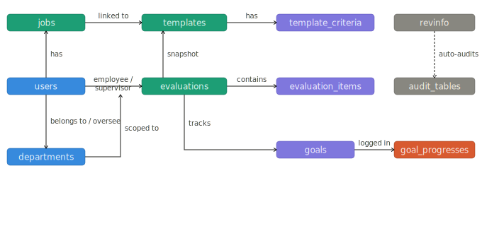
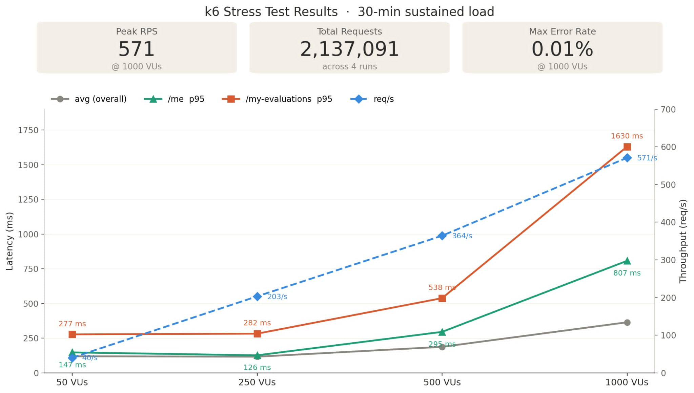
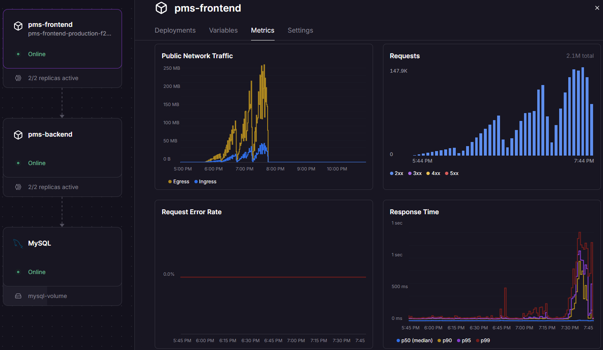
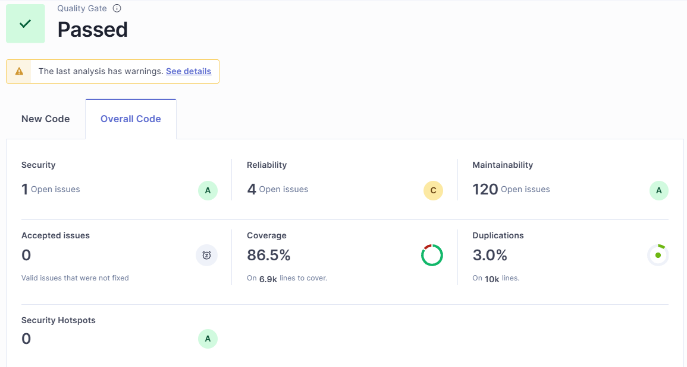

# Performance Management System

**Team 1:** 吳政霖, 吳鎮星, 郭又綸, 楊宗勳, 蔣馥安

---

# AC — Goal Management

| Requirement | When | Then |
|---|---|---|
| SMART goal setting | Employee drafts a goal | All SMART fields enforced |
| Progress tracking | Employee add a progress | Linked to goal |
| Customizable templates | Manager opens a review | Shows HR-defined job criteria |

---

# AC — Performance Review & Compliance

| Requirement | When | Then |
|---|---|---|
| Result dispute | Employee receive review | Must confirm or reject to proceed |
| RBAC | Access restricted resource | System denies |
| Immutable audit log | Save change | New entry appended |

---

# ER Model

---

# Evaluation Flow

**Goal & Progress Phase**

**Review Phase**

---

# Application Architecture

## Backend

- Modules: `auth` · `user` · `evaluation` · `template` · `audit`

## Frontend
- React SPA — Pages & reusable Components, with a TypeScript API client auto-generated by Orval from the OpenAPI spec.

---

# System Architecture

- JWT stored in `HttpOnly; Secure; SameSite=Lax` cookie, preventing XSS & CSRF
- 2 replicas of backend & frontend respectively, behind Railway's load balancer

---

# Unit Tests

| Layer | Focus | Tool |
|---|---|---|
| Controller | Response format & exception shape | MockMvc |
| Service | Business logic & state transitions | Mockito |
| Repository | CRUD correctness | H2 + DataJpaTest |
| Frontend Section | Component behaviour per evaluation status | Vitest + RTL |

- Coverage from SonarScanner: Backend 70.9%, Frontend 89.1%

---

# Stress Test

| | |
|---|---|
| **Tool** | k6 |
| **Scenario** | Authenticate once, then repeatedly call `/me` and `/my-evaluations` |
| **Load profile** | 50 → 250 → 500 → 1000 VUs, 30 min per stage |
| **Metrics** | Throughput (req/s), p95 latency per endpoint, error rate |

---

# Stress Test Result

---

# Observability - Railway Built-in Dashboard

---

# Code Quality

**CI/CD** — Tests + image build gate PR; Merge to `main` → GHCR → Railway redeploy

---

# Demo

- Demo Link: https://pms-frontend-production-f2a8.up.railway.app
- Github Repo: https://github.com/nora6633/ntu-cloudnative-pms
