# Performance Management System

A web-based PMS for managing employee goals, performance reviews, and audit trails — built with Spring Boot, React, and deployed on Railway.

**Team 1:** 吳政霖, 吳鎮星, 郭又綸, 楊宗勳, 蔣馥安

---

# Evaluation Flow

**Goal & Progress Phase**

**Review Phase**

---

# Application Architecture

## Backend

## Frontend
React SPA — Pages & reusable Components, with a TypeScript API client auto-generated by Orval from the OpenAPI spec.

---

# System Architecture

- JWT stored in `HttpOnly; Secure; SameSite=Lax` cookie — prevents XSS & CSRF
- Nginx proxies `/api/*` to backend — single origin, so cookies are never blocked

---

# Testing

| Layer | Focus | Tool |
|---|---|---|
| Controller | Response format & exception shape | MockMvc |
| Service | Business logic & state transitions | Mockito |
| Repository | CRUD correctness | H2 + DataJpaTest |
| Frontend Section | Component behaviour per evaluation status | Vitest + RTL |

**Coverage** — Backend 83.92% · Frontend 54.64% (statements)

---

# Code Quality & Operations

**Pull Request Workflow** — 35+ PRs merged · 422+ CI job runs
- Tests + Docker build required to pass before merge
- Reviews focus on architecture compliance and test strategy

**CD Pipeline**
- Merge to `main` → CI builds and pushes images to GHCR → Railway pulls and redeploys

---

# Demo

- Demo Link: https://pms-frontend-production-f2a8.up.railway.app

- Github Repo: https://github.com/nora6633/ntu-cloudnative-pms